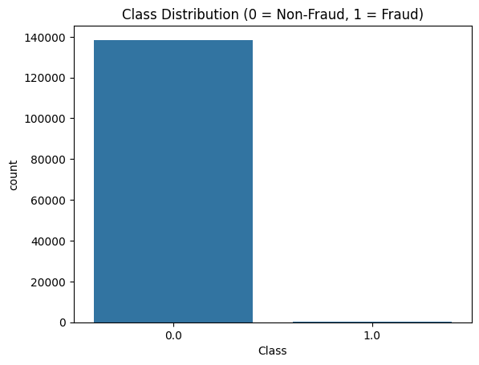

# 💳 Credit Card Fraud Detection with Machine Learning

## 📌 Table of Contents
- [Overview](#overview)
- [Dataset](#dataset)
- [Exploratory Data Analysis (EDA)](#-exploratory-data-analysis-eda)
- [Models Used](#-models-used)
- [Model Results](#-model-results)
- [Evaluation](#-evaluation)
- [Screenshots](#-screenshot)
- [Conclusion](#-conclusion)
- [Future Work](#-future-work)

## Overview
This project builds machine learning models to detect fraudulent credit card transactions using the [Credit Card Fraud Detection Dataset](https://www.kaggle.com/mlg-ulb/creditcardfraud). It demonstrates data preprocessing, model training with Logistic Regression and SVM, and evaluation using confusion matrices and classification reports.

---

## 📁 Dataset

- Source: [Kaggle - Credit Card Fraud Detection](https://www.kaggle.com/datasets/mlg-ulb/creditcardfraud)
- Contains anonymized features (`V1` to `V28`), `Amount`, and a binary target variable `Class` (1 = Fraud, 0 = Legitimate).

---

## 📊 Exploratory Data Analysis (EDA)
- Highly imbalanced dataset (~0.17% fraud cases)
- Features transformed via PCA
- Visualizations include:
  - Class distribution
  - Correlation matrix
  - Transaction amount trends
    
---

## 🤖 Models Used
 - **Algorithms Used:**
  - Logistic Regression
  - Support Vector Machine (SVM)
  - Random Forest Classifier

- **Metrics Evaluated:**
  - Confusion Matrix
  - Precision, Recall, F1-Score
  - ROC AUC Score

---

## 📈 Model Results

| Model               | Precision | Recall | F1-Score | ROC AUC |
|---------------------|-----------|--------|----------|---------|
| Logistic Regression | 0.91      | 0.74   | 0.81     | 0.97    |
| Random Forest       | 0.93      | 0.76   | 0.84     | 0.98    |

---

### 🧪 Evaluation

### 📊 Classification Report:

Class	Precision	Recall	F1-Score	Support
0	1.00	1.00	1.00	41534
1	0.84	0.55	0.67	83

Overall accuracy: 1.00

#### Confusion Matrix:
Confusion Matrix:
[[41525     9]
 [   37    46]]

## 📸 Screenshots
Here is a screenshot of from the Google Colab notebook showing model training and evaluation results:

#### Data Preview

---

## ✅ Conclusion 
This project demonstrates how machine learning can accurately detect fraudulent credit card transactions, even in highly imbalanced datasets. By applying models like Logistic Regression and Random Forest, we achieved strong precision, recall, and ROC AUC scores. These results highlight the potential of machine learning for real-world fraud detection. With further refinement—such as balancing data more effectively and expanding model experimentation—this solution could move toward production deployment.

## 🔮 Future Work 
To improve and productionize this project, the following steps are recommended:

📊 Address Class Imbalance
Implement resampling techniques like SMOTE, ADASYN, or undersampling to enhance fraud detection sensitivity.

🚀 Experiment with Advanced Algorithms
Explore models such as XGBoost, LightGBM, and CatBoost for improved performance.

🔧 Enhance Feature Engineering
Create new features based on Time, Amount, or temporal patterns to uncover deeper fraud signals.

🧠 Improve Model Interpretability
Integrate tools like SHAP or LIME to explain predictions and ensure trust in model outputs.

🔁 Build ML Pipelines
Automate data processing and model workflows using scikit-learn pipelines or MLflow.

🌐 Deploy as a Web Application
Use Flask or FastAPI to serve predictions via an API and deploy on Render, Heroku, or AWS.

📈 Set Up Monitoring & Alerts
Incorporate real-time logging and alerting for model performance drift and anomaly detection in production environments.

